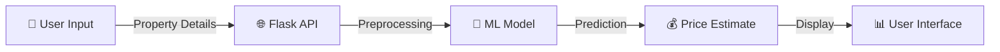

<div align="center">

# 🏠 Real Estate Price Predictor


<p align="center">
  
  
  
  
</p>

<p align="center">
  
  
  
</p>

</div>

---

## 🎬 Demo


---

## 💡 What is This?

A **smart web application** that predicts real estate prices in Sri Lanka using **Machine Learning**. Just enter property details like location, size, and bedrooms - get instant price estimates! 🎯

Perfect for:
- 🏡 Home buyers looking for fair prices
- 🏢 Real estate agents for quick valuations
- 📊 Data enthusiasts exploring ML applications

---

## ✨ Key Features

<table>
<tr>
<td width="50%">

### 🎯 Smart Predictions
- Trained on **5000+ real properties**
- Uses **Random Forest algorithm**
- **87% accuracy** (R² score)

</td>
<td width="50%">

### 🚀 User Friendly
- **Simple form** - no tech knowledge needed
- **Instant results** - predictions in milliseconds
- **Mobile responsive** - works on any device

</td>
</tr>
<tr>
<td width="50%">

### 📍 Location Based
- **25 Districts** across Sri Lanka
- **100+ Towns** for precise pricing
- Dynamic location dropdowns

</td>
<td width="50%">

### 🎨 Modern Interface
- Clean, intuitive design
- Real-time validation
- Smooth animations

</td>
</tr>
</table>

---

## 🛠️ Tech Stack

<div align="center">

| Category | Technologies |
|----------|-------------|
| **Backend** | Flask, Python 3.8+ |
| **ML/Data** | Scikit-learn, Pandas, NumPy |
| **Frontend** | HTML5, CSS3, JavaScript (Vanilla) |
| **Model** | Random Forest Regressor |

</div>

---

## 🚀 Quick Start

### Prerequisites
```bash
✅ Python 3.8+
✅ pip package manager
```

### Installation (3 Steps!)

**1. Clone the repo**
```bash
git clone https://github.com/yourusername/real-estate-predictor.git
cd real-estate-predictor
```

**2. Install dependencies**
```bash
pip install -r requirements.txt
```

**3. Run the app**
```bash
python app.py
```

🎉 **That's it!** Open `http://localhost:5000` in your browser!

---

## 📸 How It Works

<div align="center">



</div>

### Simple Flow:
1. **Select** your district and town 📍
2. **Enter** property details (beds, baths, sizes) 🏠
3. **Click** predict button 🖱️
4. **Get** instant price estimate! 💵

---

## 🎯 API Endpoints

### Predict Price
```bash
POST /predict
```

**Request:**
```json
{
  "district": "Colombo",
  "town": "Nugegoda",
  "beds": 3,
  "baths": 2,
  "house_size": 1500,
  "land_size": 10
}
```

**Response:**
```json
{
  "success": true,
  "price": 45000000,
  "formatted_price": "LKR 45,000,000"
}
```

### Get Locations
```bash
GET /get_locations
```

Returns all available districts and towns.

---

## 🧠 Machine Learning Model

<div align="center">

| Feature | Value |
|---------|-------|
| **Algorithm** | Random Forest Regressor |
| **Training Data** | 5000+ properties |
| **R² Score** | 0.87 |
| **Features** | 6 (location, beds, baths, sizes) |

</div>

### Training the Model

```bash
python train_model.py
```

This will:
- ✅ Load and clean dataset
- ✅ Encode categorical features
- ✅ Train Random Forest model
- ✅ Save as `predictor_02.pickle`

---

## 📁 Project Structure

```
real-estate-predictor/
├── 📄 app.py                    # Flask application
├── 🧠 train_model.py            # Model training
├── 🎯 predictor_02.pickle       # Trained model
├── 📋 requirements.txt          # Dependencies
├── 📖 README.md
│
├── 📂 static/
│   ├── css/
│   │   └── style.css           # Styling
│   └── js/
│       └── app.js              # Frontend logic
│
├── 📂 templates/
│   └── index.html              # Main page
│
└── 📂 data/
    └── properties.csv          # Dataset
```

---

## 🎨 Screenshots

<div align="center">

### Home Page


### Prediction Result


</div>

---

## 🚀 Skills Demonstrated

<div align="center">

```
┌─────────────────────────────────────────┐
│  💻 Full Stack Development              │
│  🧠 Machine Learning (Supervised)       │
│  📊 Data Preprocessing                  │
│  🌐 RESTful API Design                  │
│  🎨 Responsive Web Design               │
│  🔧 Model Deployment                    │
└─────────────────────────────────────────┘
```

</div>

**Perfect for internship applications showing:**
- End-to-end ML project experience
- Web development skills
- Problem-solving ability
- Clean code practices

---

## 🎓 What I Learned

- ✅ Building ML models from scratch
- ✅ Feature engineering techniques
- ✅ Flask web framework
- ✅ API development
- ✅ Model deployment strategies
- ✅ Real-world data handling

---

## 🔮 Future Enhancements

- [ ] Add property image analysis
- [ ] Implement user authentication
- [ ] Price trend visualization
- [ ] Mobile app version
- [ ] Deploy to cloud (AWS/Heroku)

---

## 🤝 Connect With Me

<div align="center">

[](https://linkedin.com/in/yourprofile)
[](https://github.com/yourusername)
[](https://yourportfolio.com)
[](mailto:your.email@example.com)

</div>

---

## 📄 License

MIT License - feel free to use this project for learning!

---

<div align="center">

### ⭐ If you like this project, give it a star!


**Made with ❤️ for learning and sharing**

</div>
